# dart_janken_example1

## 概要
二人でジャンケンした場合の勝敗を返すサンプルプログラムです。  
ユーザー①の手とユーザー②の手を入力すると、どっちが勝ったか、もしくは引き分けかを返します。

## クラス図


## 実行例
```dart
final janken = Janken();
var user1Hand = JankenHand.guu;
var user2Hand = JankenHand.choki;
var result = janken.run(user1Hand, user2Hand);
print('user1Hand = $user1Hand');
print('user2Hand = $user2Hand');
print('result = $result');
```
実行結果
```
user1Hand = JankenHand.guu
user2Hand = JankenHand.choki
result = JankenResult.user1Win
Exited
```